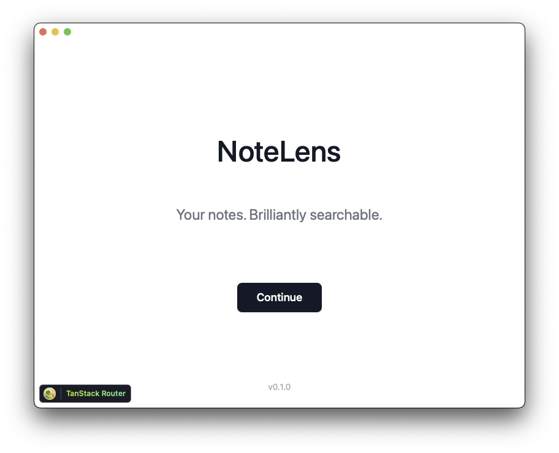

# NoteLens

NoteLens is a semantic search application for Apple Notes. It allows you to search your notes using natural language queries, leveraging vector embeddings for semantic similarity rather than just keyword matching.



## Features

- **Semantic Search**: Find notes based on meaning, not just keywords
- **Real-time Updates**: Automatically indexes new and modified notes
- **Intuitive Interface**: Clean, modern UI with dark mode support
- **Native Performance**: Built as a desktop application for macOS

## Architecture

NoteLens is built with a modern tech stack:

### Frontend

- **React + TypeScript**: Type-safe, component-based UI
- **TanStack Router**: Type-safe routing with automatic route generation
- **Tailwind CSS**: Utility-first CSS framework for styling
- **Zustand**: Lightweight state management
- **Framer Motion**: Animation library for smooth transitions

### Backend

- **Python**: Core backend functionality with async processing
- **SQLite + vector extensions**: Database with semantic search capabilities
- **WebSockets**: Real-time communication between frontend and backend
- **Watchdog**: File system monitoring for detecting note changes

### Desktop Integration

- **Tauri**: Rust-based framework that bundles the app into a native desktop application
- **Rust plugins**: Native capabilities and performance optimizations

## Technical Highlights

- **Vector Embeddings**: Uses text embeddings to create semantic representations of notes
- **Cross-process Communication**: WebSockets connect the React frontend to the Python backend
- **Apple Notes Integration**: Custom parser extracts and processes data from the Apple Notes database
- **Native Performance**: Rust and Python provide native performance while maintaining a modern web UI

## Prerequisites

- macOS (Apple Notes is required)
- Python 3.12+
- Node.js 20+
- Rust 1.77+
- PNPM package manager

## Installation

1. Clone the repository:

```bash
git clone https://github.com/yourusername/notelens.git
cd notelens
```

2. Install frontend dependencies:

```bash
pnpm install
```

3. Install Python dependencies:

```bash
cd src-python
poetry install
cd ..
```

4. Start the backend:

```bash
cd src-python
poetry run python -m notelens.main
```

5. Start the frontend:

```bash
pnpm tauri dev
```

## Development

The application consists of three main parts:

1. **React Frontend** (`src/`): The user interface
2. **Python Backend** (`src-python/`): Core search and indexing functionality
3. **Tauri Integration** (`src-tauri/`): Desktop application wrapper

### Development Script

You can use the included dev script to start both frontend and backend services simultaneously:

```bash
./dev.sh
```

This script uses tmux to run both services in separate windows:
- Window 0: Frontend (Tauri)
- Window 1: Backend (Python)

**Usage:**
- Navigate between windows: `Ctrl+B` then window number (0 or 1)
- Detach from session (leaving services running): `Ctrl+B` then `D`
- Reattach to session: `tmux attach -t notelens-dev`

**Stopping the services:**
- Option 1: Press `Ctrl+C` in each tmux window to stop the services
- Option 2: Kill the entire session with: `tmux kill-session -t notelens-dev`

## License

[MIT License](LICENSE)
